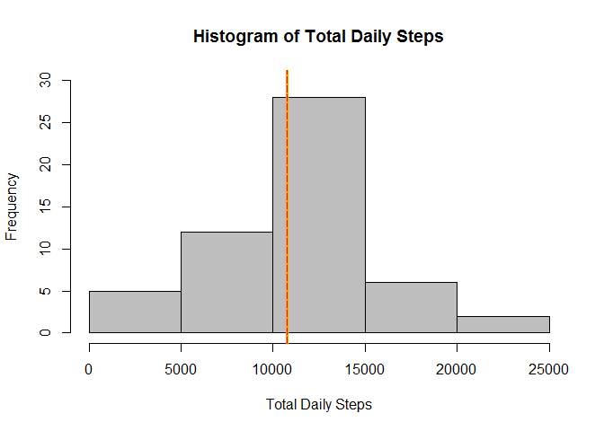
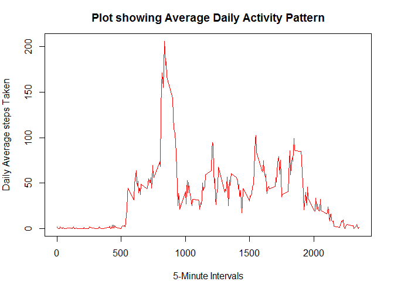
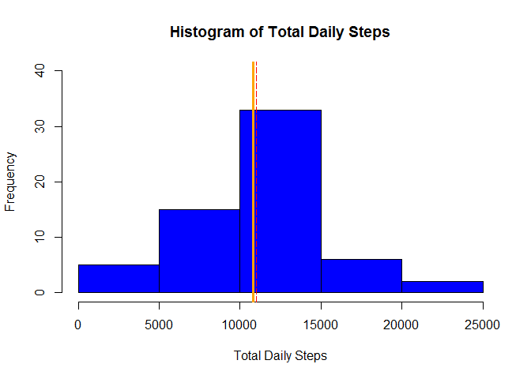
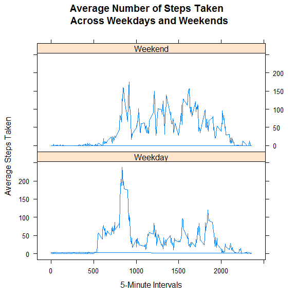

# Reproducible Research: Peer Assessment 1

## Introduction
This document provides answers to questions about the activity of an anonymous individual collected during the months of October and November, 2012 with the use of activity monitoring devices. 

This document is produced as a Course Project of [Reproducible Research](https://www.coursera.org/course/repdata), a part of the [Datascience Specialization](https://www.coursera.org/specialization/jhudatascience/1?utm_medium=catalog) offered by [Johns Hopkins University](https://www.jhu.edu/) on [Coursera](https://www.coursera.org/jhu).

The [Activity monitoring data](https://d396qusza40orc.cloudfront.net/repdata%2Fdata%2Factivity.zip) is available on the Course Website. You may wish to view the details of the dataset and variables as well as the steps required to answer each of the questions in this project in the [README](https://github.com/jkayode/RepData_PeerAssessment1/blob/master/README.md) file submitted with this project.

## Loading and preprocessing the data
First step is to load the data, set the working directory, unzip the data and read the data file.

```r
setwd("C:/Users/user/datasciencecoursera/Reproducible Research/RepData_PeerAssessment1")
zipFilePath <- "./activity.zip"
file <- unzip(zipFilePath, exdir="./data")
activityDataset <- read.csv(file)
```

Take a peek at the data by viewing the structure and summary

```r
str(activityDataset)
```

```
## 'data.frame':	17568 obs. of  3 variables:
##  $ steps   : int  NA NA NA NA NA NA NA NA NA NA ...
##  $ date    : Factor w/ 61 levels "2012-10-01","2012-10-02",..: 1 1 1 1 1 1 1 1 1 1 ...
##  $ interval: int  0 5 10 15 20 25 30 35 40 45 ...
```


```r
summary(activityDataset)
```

```
##      steps                date          interval     
##  Min.   :  0.00   2012-10-01:  288   Min.   :   0.0  
##  1st Qu.:  0.00   2012-10-02:  288   1st Qu.: 588.8  
##  Median :  0.00   2012-10-03:  288   Median :1177.5  
##  Mean   : 37.38   2012-10-04:  288   Mean   :1177.5  
##  3rd Qu.: 12.00   2012-10-05:  288   3rd Qu.:1766.2  
##  Max.   :806.00   2012-10-06:  288   Max.   :2355.0  
##  NA's   :2304     (Other)   :15840
```

There are three variables in the dataset. The "date" variable is a factor variable and the "steps" variable is an integer variable. However it may be necessary to convert these variables to Date and numeric respectively for ease of analysis.

```r
activityDataset <- transform(activityDataset, date=as.Date(date), steps=as.numeric(steps))
str(activityDataset)
```

```
## 'data.frame':	17568 obs. of  3 variables:
##  $ steps   : num  NA NA NA NA NA NA NA NA NA NA ...
##  $ date    : Date, format: "2012-10-01" "2012-10-01" ...
##  $ interval: int  0 5 10 15 20 25 30 35 40 45 ...
```


## What is mean total number of steps taken per day?
First step is to sum the total steps for each day and then calculate the mean and median values.

```r
totalDailySteps <- tapply(activityDataset$steps, INDEX=activityDataset$date, FUN=sum)
meanValue <- mean(totalDailySteps, na.rm=TRUE) # Mean Value Calculation
medianValue <- median(totalDailySteps, na.rm=TRUE) # Median Value Calculation
```

Plot a histogram of the total daily steps

```r
hist(totalDailySteps, 
     col="gray", 
     main="Histogram of Total Daily Steps", 
     xlab="Total Daily Steps", 
     ylim=c(0, 30))

abline(v=meanValue, col="orange", lwd=3) # Show the Mean line
abline(v=medianValue, col="red", lwd=1, lty=5) # Show the Median line
```

 

Print the mean and median values

```r
print(meanValue)
```

```
## [1] 10766.19
```

```r
print(medianValue)
```

```
## [1] 10765
```
The mean total number of steps taken per day is **10766.19**

## What is the average daily activity pattern?
First step is to get the average daily steps by 5 minutes time interval

```r
library(dplyr)
averageIntervalSteps <- activityDataset %>%
        select(interval, steps) %>%
        group_by(interval) %>%
        summarise(steps=mean(steps, na.rm=TRUE))

str(averageIntervalSteps) # Take a peek at the average Interval Steps data
```

```
## Classes 'tbl_df', 'tbl' and 'data.frame':	288 obs. of  2 variables:
##  $ interval: int  0 5 10 15 20 25 30 35 40 45 ...
##  $ steps   : num  1.717 0.3396 0.1321 0.1509 0.0755 ...
##  - attr(*, "drop")= logi TRUE
```

Next step is to make a plot of average steps by interval to show daily activity pattern

```r
par(mar=c(4,4,3,2))
plot(averageIntervalSteps$interval, averageIntervalSteps$steps, 
     type="l", col="red",
     main ="Plot showing Average Daily Activity Pattern",
     xlab="5-Minute Intervals",
     ylab="Daily Average steps Taken")
```

 

To determine the 5-minute interval, on average across all the days in the dataset that contains the maximum number of steps;

```r
maxStepsInterval <- averageIntervalSteps[which.max(averageIntervalSteps$steps),]
print(maxStepsInterval)
```

```
## Source: local data frame [1 x 2]
## 
##   interval    steps
## 1      835 206.1698
```


## Imputing missing values
First Step is to report the total number of missing values (NAs).

```r
totalNAs <- length(activityDataset$steps[is.na(activityDataset$steps)])
print(totalNAs)
```

```
## [1] 2304
```

Second step is to devise a way to fill in the missing values (NAs).
I choose to fill the missing values with the mean value for the intervals in each weekday. 


```r
activityDataset <- tbl_df(activityDataset)
imputeNAsData <- activityDataset %>%
                mutate(weekday=format(date, "%A")) %>%
                group_by(interval, weekday) %>%
                mutate(steps=ifelse(is.na(steps), mean(steps, na.rm=TRUE), steps)) %>%
                mutate(steps=round(steps, 2))
```

Third step is to create a new dataset that is equal to the original dataset but with the missing data filled in.

```r
newDataset <- imputeNAsData[,1:3]
print(newDataset)
```

```
## Source: local data frame [17,568 x 3]
## 
##    steps       date interval
## 1   1.43 2012-10-01        0
## 2   0.00 2012-10-01        5
## 3   0.00 2012-10-01       10
## 4   0.00 2012-10-01       15
## 5   0.00 2012-10-01       20
## 6   5.00 2012-10-01       25
## 7   0.00 2012-10-01       30
## 8   0.00 2012-10-01       35
## 9   0.00 2012-10-01       40
## 10  0.00 2012-10-01       45
## ..   ...        ...      ...
```

Calculate the mean and median of the new dataset with NAs imputed to compare values with previous dataset where NAs were just ignored during the calculation

```r
totalDailySteps2 <- tapply(newDataset$steps, INDEX=newDataset$date, FUN=sum)
meanValue2 <- mean(totalDailySteps2, na.rm=TRUE) # Mean Value Calculation
medianValue2 <- median(totalDailySteps2, na.rm=TRUE) # Median Value Calculation
```

Plot a histogram with the new dataset to compare with the original dataset

```r
hist(totalDailySteps2, 
     col="blue", 
     main="Histogram of Total Daily Steps", 
     xlab="Total Daily Steps", 
     ylim=c(0, 40))

abline(v=meanValue2, col="orange", lwd=3) # Show the Mean line
abline(v=medianValue2, col="red", lwd=1, lty=5) # Show the Median line
```

 

Print the mean and median values of the new dataset

```r
print(meanValue2)
```

```
## [1] 10821.21
```

```r
print(medianValue2)
```

```
## [1] 11015
```

It is observed that filling in the NAs affected the mean and median values a bit.
The mean of the new dataset is **10821.21** while the median is **11015**. The previous values were **10766.19** and **10765** respectively.

## Are there differences in activity patterns between weekdays and weekends?
First step is to include another factor variable to the new dataset that specifies weekday or weekend.

```r
newDataset2 <- newDataset %>%
        mutate(day=weekdays(date)) %>%
        mutate(type=ifelse(day %in% c("Saturday", "Sunday"), "Weekend", "Weekday")) %>%
        group_by(interval, type) %>%
        mutate(meanSteps=mean(steps))

print(newDataset2)
```

```
## Source: local data frame [17,568 x 6]
## Groups: interval, type
## 
##    steps       date interval    day    type  meanSteps
## 1   1.43 2012-10-01        0 Monday Weekday 2.31088889
## 2   0.00 2012-10-01        5 Monday Weekday 0.45000000
## 3   0.00 2012-10-01       10 Monday Weekday 0.17511111
## 4   0.00 2012-10-01       15 Monday Weekday 0.20000000
## 5   0.00 2012-10-01       20 Monday Weekday 0.08888889
## 6   5.00 2012-10-01       25 Monday Weekday 1.56400000
## 7   0.00 2012-10-01       30 Monday Weekday 0.62222222
## 8   0.00 2012-10-01       35 Monday Weekday 1.15000000
## 9   0.00 2012-10-01       40 Monday Weekday 0.00000000
## 10  0.00 2012-10-01       45 Monday Weekday 1.80000000
## ..   ...        ...      ...    ...     ...        ...
```

Next create a panel plot to show average activity trend by week type

```r
library("lattice")
plot <- xyplot(meanSteps ~ interval | as.factor(type), data=newDataset2, 
               type="l", layout=c(1,2),
               main="Average Number of Steps Taken \n Across Weekdays and Weekends",
               xlab="5-Minute Intervals",
               ylab="Average Steps Taken")

print(plot)
```

 

From the plot it is obvious that there are differences in activity patterns between weekdays and weekends.
